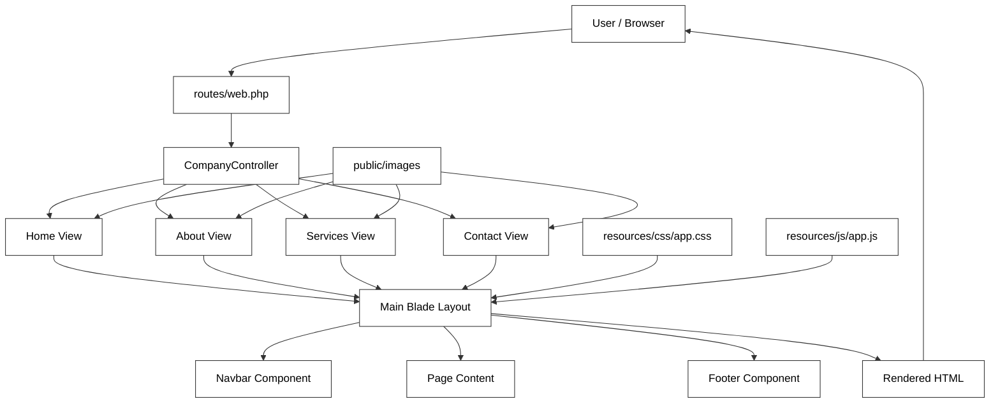
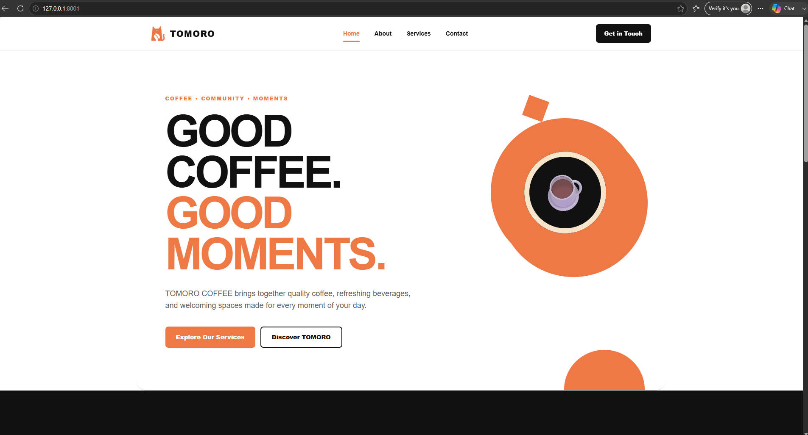

# TOMORO COFFEE — Company Profile Website

A Laravel-based company profile website developed for ITST 302.  
The project presents **TOMORO COFFEE**, a coffee brand focused on quality coffee, refreshing beverages, welcoming spaces, and enjoyable everyday coffee moments.

---

## Introduction

A company profile website is a website that introduces a business to its customers and gives them important information about the company. It usually contains the company's background, products or services, contact details, and other information that helps visitors understand what the business offers.

Businesses need a company profile website because it gives them an online presence where customers can easily learn more about the company. It can also make the business look more professional and make important information easier to access.

For this project, I created a company profile website for **TOMORO COFFEE** using Laravel. The main purpose of the project is to apply the basic concepts of Laravel MVC, routing, controllers, Blade templates, reusable components, and responsive web design in an actual website.

---

## Objectives

The objectives of this project are to:

- Create a responsive multi-page company profile website using Laravel.
- Understand how the Model-View-Controller architecture works.
- Create and manage routes using Laravel Routing.
- Use a controller to handle requests for different pages.
- Build website pages using the Blade Templating Engine.
- Create reusable layouts, navigation, and footer components.
- Organize the Laravel project using a proper folder structure.
- Apply responsive CSS styling to create a clean and usable interface.
- Use Git and GitHub to track the development of the project.
- Document the project properly using Markdown.

---

## Project Overview

**TOMORO COFFEE** is designed as a modern and responsive company profile website with a clean coffee-shop-inspired design, orange accents, simple typography, and organized layouts.

The website provides visitors with information about the company, its story, services, mission, vision, values, team, and contact information.

### Main Pages

- **Home** — Introduction to TOMORO COFFEE and its featured offerings
- **About** — Company story, mission, vision, core values, and team
- **Services** — Overview of the company's six main offerings
- **Contact** — Company information, social media links, and contact form

---

## Features

### Home Page

- Coffee-themed hero section
- Company introduction
- Featured offerings
- Call-to-action sections
- Responsive layout
- Custom visual design

### About Page

- Company story
- Mission and vision
- Core values
- Team section
- Responsive layout

The website presents four main values:

1. Quality
2. Community
3. Warmth
4. Innovation

### Services Page

The website presents six main offerings:

1. Signature Coffee
2. Specialty Beverages
3. Food & Pastries
4. Digital Ordering
5. Coffee Shop Experience
6. Promotions & Offers

### Contact Page

- Company address
- Email information
- Phone number
- Social media links
- Contact form
- Name, email, subject, and message fields

The contact form is currently for interface demonstration only and does not yet process or store submitted messages.

---

## Technologies Used

- **Laravel**
- **PHP**
- **Blade Templates**
- **HTML**
- **CSS**
- **JavaScript**
- **Vite**
- **Node.js**
- **NPM**
- **Git**
- **GitHub**

### Frontend

The website uses custom CSS for the overall visual design.

The design mainly uses:

- Orange
- White
- Black

The website also uses responsive layouts, custom cards, buttons, hover effects, and media queries to adjust the design for different screen sizes.

---

## Laravel Architecture

The project follows Laravel's standard structure and uses the **Model-View-Controller (MVC)** architecture to keep the application organized.

### Important Directories

```text
app/
├── Http/
├── Models/
└── Providers/

bootstrap/

config/

resources/
├── css/
├── js/
└── views/
    ├── components/
    ├── layouts/
    └── pages/

routes/
├── web.php
└── console.php

public/
└── images/

screenshots/

documentation/
```

### Folder Descriptions

| Folder | Purpose |
|---|---|
| `app/` | Contains the main application code, including controllers and models. |
| `routes/` | Contains the route definitions of the application. The website routes are stored in `web.php`. |
| `resources/` | Contains Blade views, CSS, JavaScript, and other source files used by the website. |
| `public/` | Contains publicly accessible files such as images and Laravel's main entry point. |
| `bootstrap/` | Contains files used by Laravel when starting and loading the application. |
| `config/` | Contains the configuration files used by the Laravel application. |
| `screenshots/` | Contains screenshots used for project documentation. |
| `documentation/` | Contains additional project documentation such as the architecture diagram. |

### Blade Views

The website uses Blade templates to organize reusable layouts and individual pages.

```text
resources/views/
├── components/
│   ├── footer.blade.php
│   └── navbar.blade.php
│
├── layouts/
│   └── app.blade.php
│
└── pages/
    ├── home.blade.php
    ├── about.blade.php
    ├── services.blade.php
    └── contact.blade.php
```

---

## MVC Architecture

The project follows Laravel's **Model-View-Controller (MVC)** architecture. MVC separates the different parts of an application based on their responsibilities.

Laravel uses MVC because it helps keep the application organized. Instead of placing routes, page logic, and interface code in one file, each part has its own responsibility.

### Advantages of MVC

- Better organization of code
- Easier maintenance
- Separation of responsibilities
- Reusable code and components
- Easier debugging
- Better structure for larger applications

### Model

The **Model** is normally responsible for handling application data and database-related operations.

For this company profile website, there is currently no major database functionality because the website mainly displays company information.

Laravel's model directory is located at:

```text
app/Models/
```

### View

The **View** is responsible for the content displayed to the user.

The project uses Laravel's Blade templating engine. The main website pages are stored inside:

```text
resources/views/pages/
```

The main views are:

```text
home.blade.php
about.blade.php
services.blade.php
contact.blade.php
```

The project also uses a shared layout and reusable components for common elements such as the navbar and footer.

### Controller

The **Controller** handles requests from the routes and decides which Blade view should be returned.

The project uses:

```text
app/Http/Controllers/CompanyController.php
```

The controller contains methods for the four main pages:

```php
public function home()
{
    return view('pages.home');
}

public function about()
{
    return view('pages.about');
}

public function services()
{
    return view('pages.services');
}

public function contact()
{
    return view('pages.contact');
}
```

### MVC Request Flow

When a visitor opens a page, the request goes through the Laravel application before the final page is displayed.

```text
User / Browser
      │
      ▼
routes/web.php
      │
      ▼
CompanyController
      │
      ▼
Blade View
      │
      ▼
HTML Response
      │
      ▼
User / Browser
```

For example, when a visitor opens `/about`, Laravel checks the route, calls the `about()` method from `CompanyController`, and returns the `pages.about` Blade view.

---

## Architecture Diagram

The following diagram shows how the main parts of the TOMORO COFFEE website connect with each other.



### Architecture Flow

The website follows this general process:

1. The visitor requests a page using the browser.
2. Laravel checks `routes/web.php` for the matching route.
3. The route calls the appropriate method in `CompanyController`.
4. The controller returns the correct Blade view.
5. The Blade page uses the shared layout, navbar, and footer.
6. CSS, JavaScript, and image assets are loaded by the website.
7. Laravel returns the rendered page to the browser.

The architecture diagram can also be saved as an image inside:

```text
documentation/architecture-diagram.png
```

---

## Reusable Blade Components

The project uses reusable Blade components to avoid duplicating common website elements.

### Navbar

```text
resources/views/components/navbar.blade.php
```

The navigation component contains:

- TOMORO COFFEE branding
- Home navigation
- About navigation
- Services navigation
- Contact navigation
- Active navigation state

### Footer

```text
resources/views/components/footer.blade.php
```

The footer contains the site's closing branding and company information and is reused throughout the pages.

---

## Main Layout

The main application layout is located at:

```text
resources/views/layouts/app.blade.php
```

The layout provides the shared HTML structure for the website and includes:

- Document metadata
- Page title
- Navigation
- Main content area
- Footer
- Vite asset loading

Individual pages extend this layout using Blade's `@extends` and `@section` directives.

Example:

```blade
@extends('layouts.app')

@section('title', 'TOMORO COFFEE | About')

@section('content')

    <!-- Page content -->

@endsection
```

---

## Blade Templating Engine

Laravel Blade is the templating engine used to create the website's pages. Blade makes it easier to reuse layouts and components instead of repeating the same HTML on every page.

### Blade Layouts

The main layout of the website is:

```text
resources/views/layouts/app.blade.php
```

This file contains the common structure used by the different pages.

### Blade Components

Reusable website elements are stored inside:

```text
resources/views/components/
```

The project currently uses:

```text
navbar.blade.php
footer.blade.php
```

This avoids copying the same navigation and footer HTML into every page.

### @extends

The `@extends` directive tells a Blade page which layout it should use.

```blade
@extends('layouts.app')
```

### @section

The `@section` directive defines content that will be inserted into a specific part of the layout.

```blade
@section('content')

    <h1>About TOMORO COFFEE</h1>

@endsection
```

### @yield

The `@yield` directive creates an area in the main layout where content from an individual page can be displayed.

```blade
@yield('content')
```

### @include

The `@include` directive can be used to insert another Blade file into the current template.

Example:

```blade
@include('components.navbar')
```

Using Blade layouts and reusable components helps keep the website organized and reduces repeated HTML code.

---

## Laravel Routing

Routing determines how Laravel responds when a visitor opens a specific URL.

The website routes are defined in:

```text
routes/web.php
```

The routes connect the website URLs to `CompanyController` and their corresponding Blade views.

### Main Routes

```text
/
/about
/services
/contact
```

### GET Requests

This project uses `Route::get()` because the four main routes are used to display website pages.

A GET request is commonly used when retrieving or displaying information from a web application.

### Route Definitions

```php
Route::get('/', [CompanyController::class, 'home'])
    ->name('home');

Route::get('/about', [CompanyController::class, 'about'])
    ->name('about');

Route::get('/services', [CompanyController::class, 'services'])
    ->name('services');

Route::get('/contact', [CompanyController::class, 'contact'])
    ->name('contact');
```

### Named Routes

The project uses named routes such as `home`, `about`, `services`, and `contact`.

Named routes make navigation easier because Blade templates can use Laravel's `route()` helper instead of manually writing the URL.

Example:

```blade
<a href="{{ route('services') }}">Services</a>
```

For example, when a visitor opens `/services`, Laravel matches the URL with the Services route and calls the `services()` method from `CompanyController`.

---

## Controller

The company profile controller is located in:

```text
app/Http/Controllers/CompanyController.php
```

A controller handles requests received by the application and decides what response should be returned.

Using a controller keeps the route definitions simple and separates request handling from the website interface.

### Controller Methods

The `CompanyController` contains four main methods:

- `home()` — returns the Home page
- `about()` — returns the About page
- `services()` — returns the Services page
- `contact()` — returns the Contact page

```php
public function home()
{
    return view('pages.home');
}

public function about()
{
    return view('pages.about');
}

public function services()
{
    return view('pages.services');
}

public function contact()
{
    return view('pages.contact');
}
```

Instead of placing all the page handling directly inside `web.php`, the routes call these controller methods.

---

## Frontend Assets

The main stylesheet is located at:

```text
resources/css/app.css
```

The website uses custom CSS for its layout, colors, typography, responsive design, cards, buttons, forms, and other visual elements.

The main JavaScript file is located at:

```text
resources/js/app.js
```

The project uses Vite for frontend asset development and compilation.

The Vite configuration is defined in:

```text
vite.config.js
```

Node and NPM dependencies are managed through:

```text
package.json
package-lock.json
```

---

## Images

Website images are stored in:

```text
public/images/
```

The project uses images for TOMORO COFFEE branding, team members, and other website visual content.

### Image Assets

Current project assets include:

```text
public/images/
├── tomoro-icon.png
├── dhenzel.jpg
├── cj.jpg
└── dimps.jpg
```

These images are used throughout the website, including the branding and team sections.

Images stored in the `public/images/` directory can be accessed in Blade using Laravel's `asset()` helper.

Example:

```blade

```

---

## Screenshots

Screenshots documenting the Laravel development process and final website are shown below.

### Laravel Development

#### Route Definitions


#### Company Controller


#### Node, NPM, and Vite


---

### Project Structure

#### VS Code Project


#### Laravel Folder Structure


#### Blade Layout


---

### Website Pages

#### Home


#### About


#### Services


#### Contact


---

### Additional Required Screenshots

#### Navigation Bar


#### Footer


#### Browser Output



#### GitHub Repository


---

## Installation

### 1. Clone the Repository

```bash
git clone <repository-url>
```

### 2. Navigate to the Project

```bash
cd week03-company-profile
```

### 3. Install PHP Dependencies

```bash
composer install
```

### 4. Install Node Dependencies

```bash
npm install
```

### 5. Configure Environment

Create the `.env` file from the example:

```bash
copy .env.example .env
```

Generate the Laravel application key:

```bash
php artisan key:generate
```

### 6. Run the Development Server

Start Laravel:

```bash
php artisan serve
```

The application will be available at:

```text
http://127.0.0.1:8000
```

### 7. Run Vite

In another terminal:

```bash
npm run dev
```

Keep both Laravel and Vite running while viewing the website.

---

## Development Workflow

The project was developed incrementally using Git.

Major development milestones include:

```text
1. Laravel project initialization
2. Company profile controller and routes
3. Reusable layout and navigation components
4. Home page
5. CSS and JavaScript assets
6. Website images
7. About page
8. Services and Contact pages
9. Final visual and responsive design refinement
10. Project documentation
```

Git was used throughout development to track changes and maintain separate commits for major features and improvements.

---

## Git Commit History

The project contains meaningful commits for the different stages of development.

```text
feat: create Laravel project
feat: add company profile controller and routes
feat: add reusable layout and navigation components
feat: add company profile home page
style: add company profile CSS
feat: add company profile JavaScript
feat: add website images
feat: add about page
feat: add services and contact pages
style: refine company profile design
docs: update project README
```

The commit history shows how the project was built step by step instead of being uploaded in a single commit.

---

## Problems Encountered

While developing the project, I encountered a few problems that helped me understand Laravel better.

### 1. Organizing Routes and Pages

At first, I had to understand how Laravel routes connect URLs to controller methods and Blade views. It was different from creating a normal HTML website where pages can simply be opened directly.

### 2. Displaying Images and Project Screenshots

Another challenge was understanding the correct paths for images. Website assets are stored in `public/images/`, while screenshots used for project documentation are stored in the `screenshots/` folder.

I also had to make sure that the filenames written in the README matched the actual image filenames.

### 3. Using Reusable Blade Files

I also had to understand how layouts and reusable Blade components work. Instead of writing the navbar and footer again on every page, Laravel allows them to be placed in separate files and reused throughout the website.

---

## Solutions

### 1. Fixing Routes and Views

I organized the four page routes inside `routes/web.php` and connected them to their corresponding methods inside `CompanyController`.

Each controller method then returns the correct Blade view.

### 2. Fixing Image and Screenshot Paths

I organized website images inside `public/images/` and used Laravel's `asset()` helper when displaying them in Blade.

For README screenshots, I placed the files inside the `screenshots/` folder and used their exact filenames in the Markdown image paths.

### 3. Using Blade Layouts and Components

I created a shared `app.blade.php` layout and separate navbar and footer components.

The individual pages use the shared layout so common website elements do not need to be duplicated.

These problems helped me understand how Laravel organizes a project and how its different parts work together.

---

## Reflection

Before working on this project, I was more familiar with creating web pages where most of the structure could be placed directly in HTML files. Developing the TOMORO COFFEE company profile website helped me understand why Laravel separates an application into different parts using the Model-View-Controller architecture.

One of the main things I learned is how routes, controllers, and views work together. The route receives the request based on the URL entered by the user. It then connects that request to a method inside the controller. The controller decides which Blade view should be returned, and that view becomes the page displayed in the browser. Seeing this process in an actual project made MVC easier for me to understand compared with only reading about it.

I also learned why separation of concerns is important. If all routes, page logic, navigation, content, and styling were placed in the same file, the project would quickly become difficult to manage. Laravel gives each part of the application a clearer responsibility. The routes handle URLs, the controller handles requests, and the Blade views handle the interface. I also used a shared layout and reusable navbar and footer components, which helped me avoid repeating the same code on every page.

Another thing I learned was the importance of organizing project files correctly. Laravel has many folders, and at first the structure can look complicated. While working on the project, I became more familiar with folders such as `app`, `resources`, `routes`, and `public`. I also learned how Vite connects the CSS and JavaScript files to the Laravel application.

Git and GitHub were also useful during development. Instead of making the entire website and uploading everything at once, I created commits for different parts of the project. This made it easier to see the progress of the website and understand how version control can be used while developing an application.

I can see how this architecture becomes more useful in larger systems. A company website is still a relatively small project, but larger enterprise applications can contain many pages, users, database operations, and features. Separating these responsibilities would make those systems easier for a development team to maintain and improve.

Overall, this project gave me a better understanding of how a Laravel application works from the browser request to the final Blade page. I still have more Laravel features to learn, especially database-related features, but this project gave me a clearer foundation for building more complex applications.

---

## Project Purpose

This project was created as part of **ITST 302** to demonstrate the development of a Laravel-based company profile website.

It demonstrates the use of:

- Laravel project structure
- MVC architecture
- Routing
- Controllers
- Blade templates
- Reusable components
- Layout inheritance
- CSS styling
- Responsive web design
- Vite and NPM
- Git version control
- GitHub

---

## References

Laravel. (n.d.). *Laravel documentation*. https://laravel.com/docs

MDN Web Docs. (n.d.). *HTML: HyperText Markup Language*. Mozilla. https://developer.mozilla.org/en-US/docs/Web/HTML

MDN Web Docs. (n.d.). *CSS: Cascading Style Sheets*. Mozilla. https://developer.mozilla.org/en-US/docs/Web/CSS

PHP Documentation Group. (n.d.). *PHP manual*. https://www.php.net/manual/en/

---

## Author

**Dhenzel Rain P. Cruz**

BSIT — 3A  
ITST 302

---

## License

This project was created for academic purposes.