# TOMORO COFFEE — Company Profile Website

A Laravel-based company profile website developed for ITST 302.  
The project presents **TOMORO COFFEE**, a coffee brand focused on quality coffee, refreshing beverages, welcoming spaces, and enjoyable everyday coffee moments.

---

## Project Overview

**TOMORO COFFEE** is designed as a modern and responsive company profile website with a clean coffee-shop-inspired design, orange accents, simple typography, and organized layouts.

The website provides visitors with information about the company, its story, services, mission, vision, values, team, and contact information.

### Main Pages

- **Home** — Introduction to TOMORO COFFEE and its featured offerings
- **About** — Company story, mission, vision, core values, and team
- **Services** — Overview of the company's six main offerings
- **Contact** — Company information, social media links, and contact form

---

## Features

### Home Page

- Coffee-themed hero section
- Company introduction
- Featured offerings
- Call-to-action sections
- Responsive layout
- Custom visual design

### About Page

- Company story
- Mission and vision
- Core values
- Team section
- Responsive layout

The website presents four main values:

1. Quality
2. Community
3. Warmth
4. Innovation

### Services Page

The website presents six main offerings:

1. Signature Coffee
2. Specialty Beverages
3. Food & Pastries
4. Digital Ordering
5. Coffee Shop Experience
6. Promotions & Offers

### Contact Page

- Company address
- Email information
- Phone number
- Social media links
- Contact form
- Name, email, subject, and message fields

The contact form is currently for interface demonstration only and does not yet process or store submitted messages.

---

## Technologies Used

- **Laravel**
- **PHP**
- **Blade Templates**
- **HTML**
- **CSS**
- **JavaScript**
- **Vite**
- **Node.js**
- **NPM**
- **Git**
- **GitHub**

### Frontend

The website uses custom CSS for the overall visual design.

The design mainly uses:

- Orange
- White
- Black

The website also uses responsive layouts, custom cards, buttons, hover effects, and media queries to adjust the design for different screen sizes.

---

## Laravel Architecture

The project follows Laravel's standard structure and uses the **Model-View-Controller (MVC)** architecture to organize the application.

### Important Directories

```text
app/
├── Http/
├── Models/
└── Providers/

resources/
├── css/
├── js/
└── views/
    ├── components/
    ├── layouts/
    └── pages/

routes/
├── web.php
└── console.php

public/
└── images/

screenshots/
```

### Blade Views

The website uses Blade templates to organize reusable layouts and individual pages.

```text
resources/views/
├── components/
│   ├── footer.blade.php
│   └── navbar.blade.php
│
├── layouts/
│   └── app.blade.php
│
└── pages/
    ├── home.blade.php
    ├── about.blade.php
    ├── services.blade.php
    └── contact.blade.php
```

---

## MVC Architecture

The project follows Laravel's **Model-View-Controller (MVC)** architecture. MVC helps separate different parts of the application so the project is easier to organize, understand, and maintain.

### Model

The **Model** is normally responsible for handling application data and database-related operations.

For this company profile website, there is currently no major database functionality because the website mainly displays static company information.

Laravel's model directory is located at:

```text
app/Models/
```

### View

The **View** is responsible for the content displayed to the user.

The project uses Laravel's Blade templating engine, and the main website pages are stored inside:

```text
resources/views/pages/
```

The main views are:

```text
home.blade.php
about.blade.php
services.blade.php
contact.blade.php
```

Reusable components and the main layout are also stored inside `resources/views/`.

### Controller

The **Controller** handles requests from the routes and decides which Blade view should be returned.

The project uses:

```text
app/Http/Controllers/CompanyController.php
```

The controller contains methods for the four main pages:

```php
public function home()
{
    return view('pages.home');
}

public function about()
{
    return view('pages.about');
}

public function services()
{
    return view('pages.services');
}

public function contact()
{
    return view('pages.contact');
}
```

### MVC Request Flow

When a visitor opens a page, the request goes through the Laravel application before the final page is displayed.

```text
User / Browser
      │
      ▼
routes/web.php
      │
      ▼
CompanyController
      │
      ▼
Blade View
      │
      ▼
HTML Response
      │
      ▼
User / Browser
```

For example, when the user visits `/about`, Laravel finds the About route, calls the `about()` method from `CompanyController`, and returns the `pages.about` Blade view.

---

## Architecture Diagram

The following diagram shows how the main parts of the TOMORO COFFEE website connect with each other.

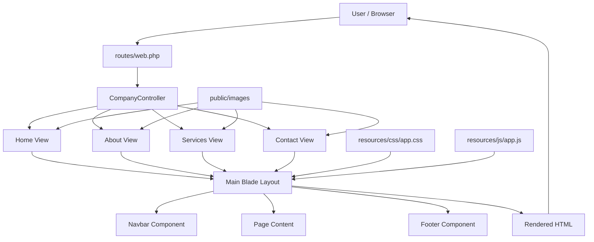

### Architecture Flow

The website follows this general process:

1. The visitor requests a page using the browser.
2. Laravel checks `routes/web.php` for the matching route.
3. The route calls the appropriate method in `CompanyController`.
4. The controller returns the correct Blade page.
5. The page uses the shared Blade layout, navbar, and footer.
6. CSS, JavaScript, and image assets are loaded by the website.
7. Laravel returns the rendered HTML page to the browser.

This structure keeps the routes, page logic, user interface, and frontend assets organized in separate parts of the project.

---

## Reusable Blade Components

The project uses reusable Blade components to avoid duplicating common website elements.

### Navbar

```text
resources/views/components/navbar.blade.php
```

The navigation component contains:

- TOMORO COFFEE branding
- Home navigation
- About navigation
- Services navigation
- Contact navigation
- Active navigation state

### Footer

```text
resources/views/components/footer.blade.php
```

The footer contains the site's closing branding and company information and is reused throughout the pages.

---

## Main Layout

The main application layout is located at:

```text
resources/views/layouts/app.blade.php
```

The layout provides the shared HTML structure for the website and includes:

- Document metadata
- Page title
- Navigation
- Main content area
- Footer
- Vite asset loading

Individual pages extend this layout using Blade's `@extends` and `@section` directives.

Example:

```blade
@extends('layouts.app')

@section('title', 'TOMORO COFFEE | About')

@section('content')

    <!-- Page content -->

@endsection
```

---

## Routing

The website routes are defined in:

```text
routes/web.php
```

The routes connect the website URLs to `CompanyController` and their corresponding Blade views.

Main routes include:

```text
/
/about
/services
/contact
```

The project uses named routes for easier navigation between pages.

```php
Route::get('/', [CompanyController::class, 'home'])
    ->name('home');

Route::get('/about', [CompanyController::class, 'about'])
    ->name('about');

Route::get('/services', [CompanyController::class, 'services'])
    ->name('services');

Route::get('/contact', [CompanyController::class, 'contact'])
    ->name('contact');
```

---

## Controller

The company profile controller is located in:

```text
app/Http/Controllers/CompanyController.php
```

The controller handles the main company profile pages and returns the appropriate Blade views.

```php
public function home()
{
    return view('pages.home');
}

public function about()
{
    return view('pages.about');
}

public function services()
{
    return view('pages.services');
}

public function contact()
{
    return view('pages.contact');
}
```

---

## Frontend Assets

The main stylesheet is located at:

```text
resources/css/app.css
```

The website uses custom CSS for its layout, colors, typography, responsive design, cards, buttons, forms, and other visual elements.

The project uses Vite for frontend asset development and compilation.

The Vite configuration is defined in:

```text
vite.config.js
```

Node and NPM dependencies are managed through:

```text
package.json
package-lock.json
```

---

## Images

Website images are stored in:

```text
public/images/
```

The project uses images for TOMORO COFFEE branding, team members, and other website visual content.

### Image Assets

Current project assets include:

```text
public/images/
├── tomoro-icon.png
├── dhenzel.jpg
├── cj.jpg
└── dimps.jpg
```

These images are used throughout the website, including the branding and team sections.

Images stored in the `public/images/` directory can be accessed in Blade using Laravel's `asset()` helper.

Example:

```blade

```

---

## Screenshots

Screenshots documenting the Laravel development process and final website are shown below.

### Laravel Development

#### Route Definitions

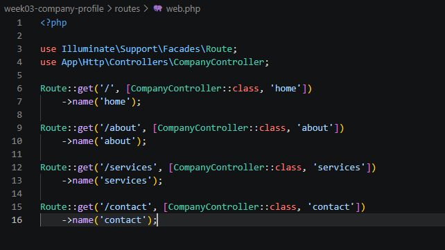

#### Company Controller

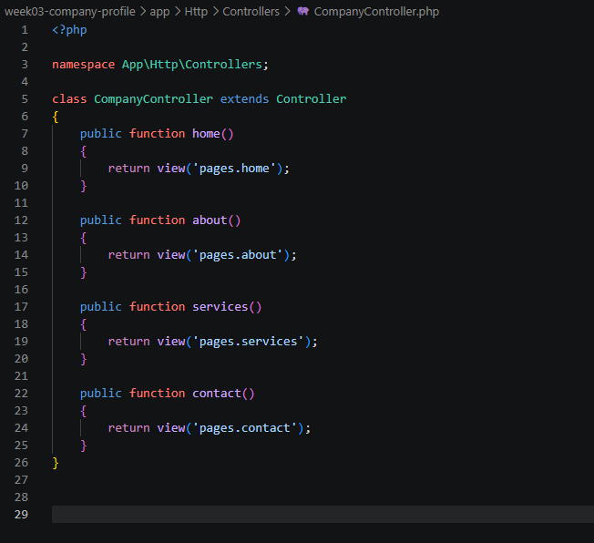

#### Node, NPM, and Vite

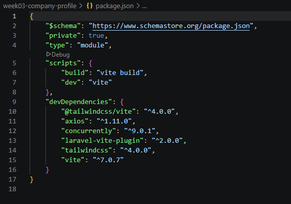

---

### Project Structure

#### VS Code Project

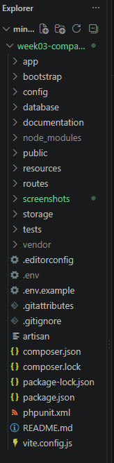

#### Laravel Folder Structure

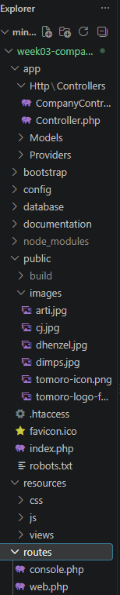

#### Blade Layout

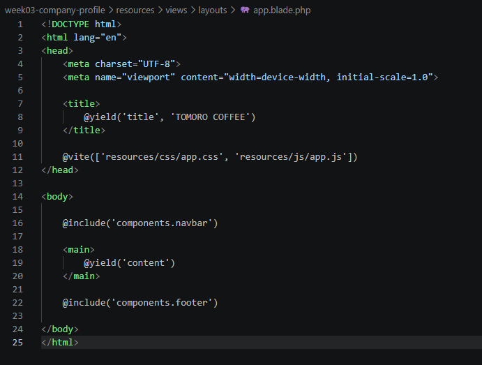

---

### Website Pages

#### Home

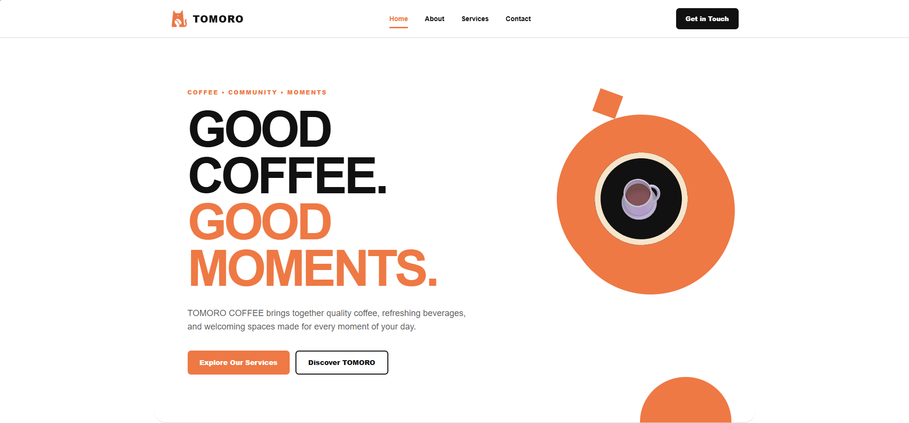

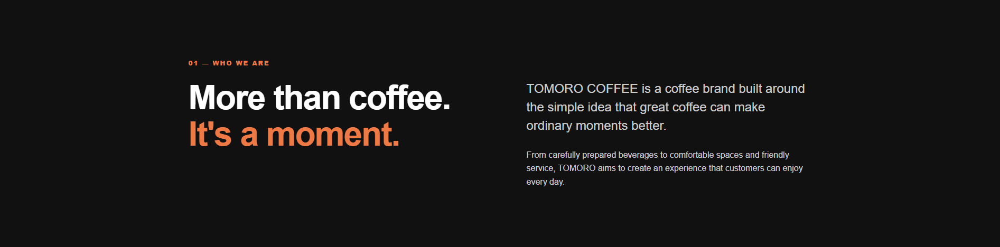

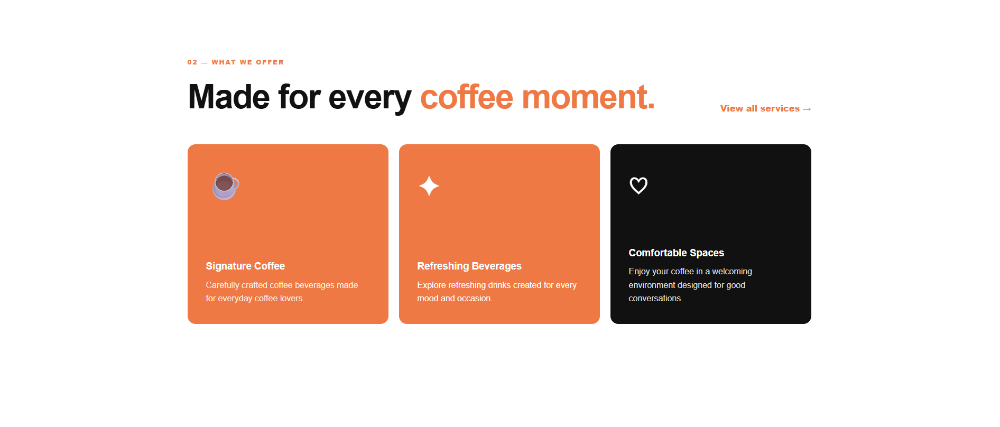

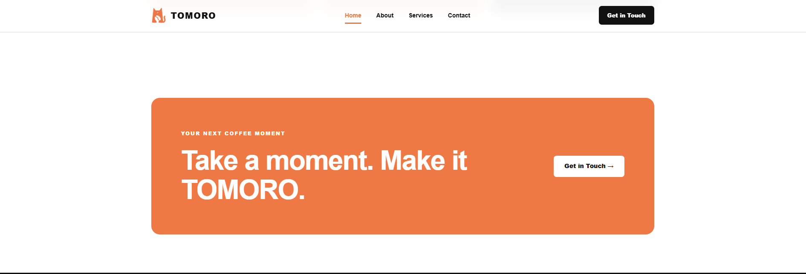

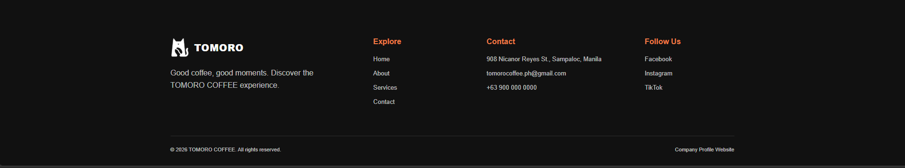

#### About

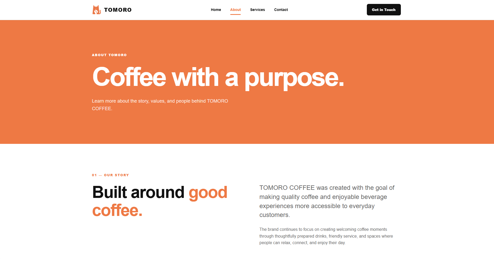

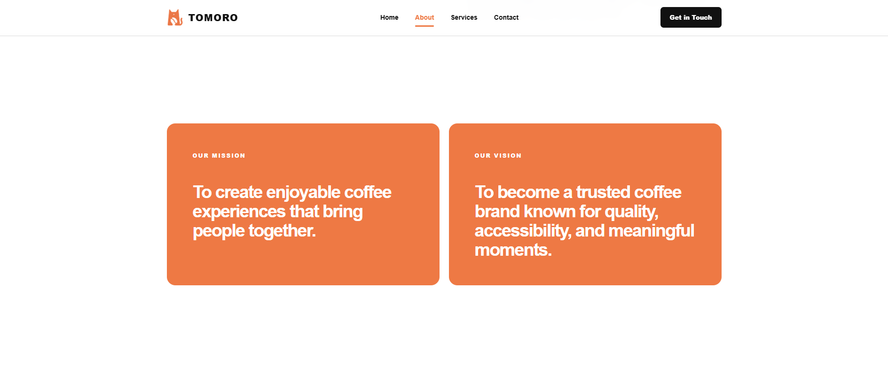

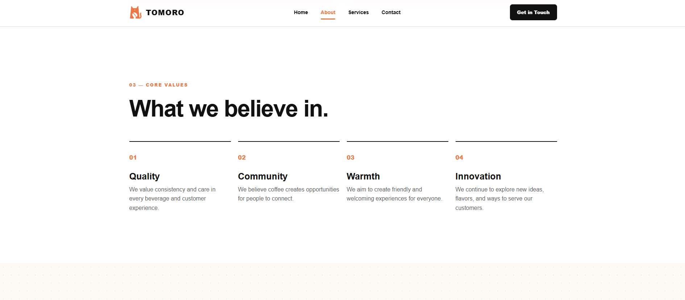

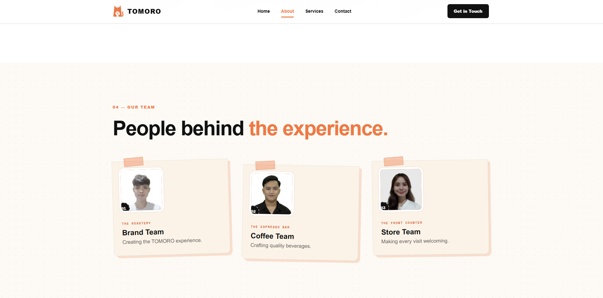

#### Services

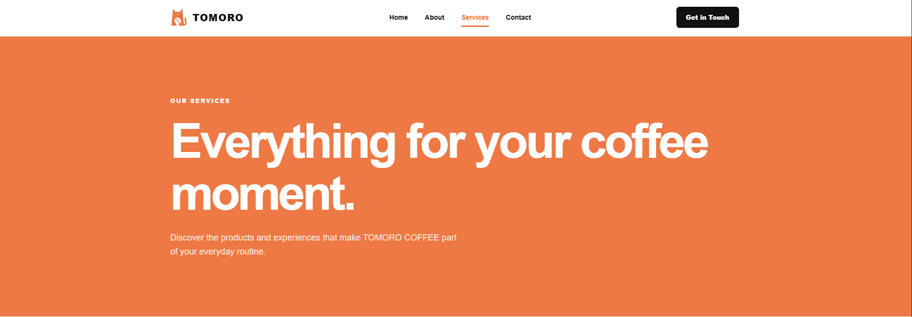

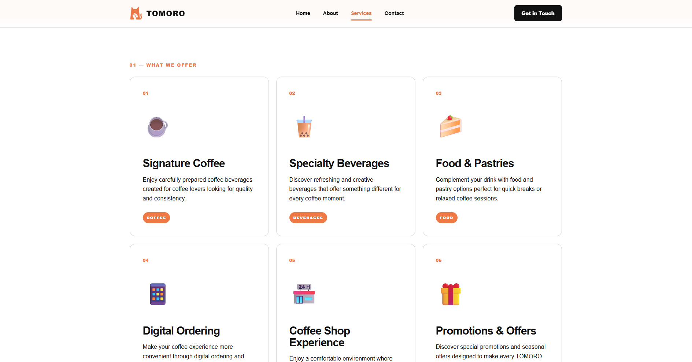

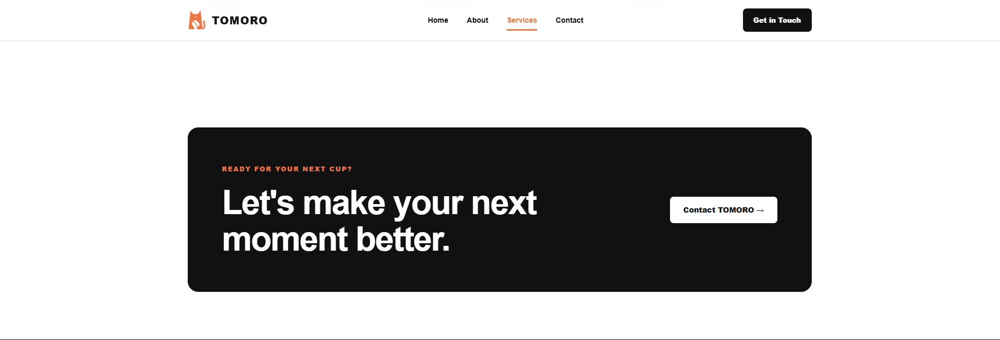

#### Contact

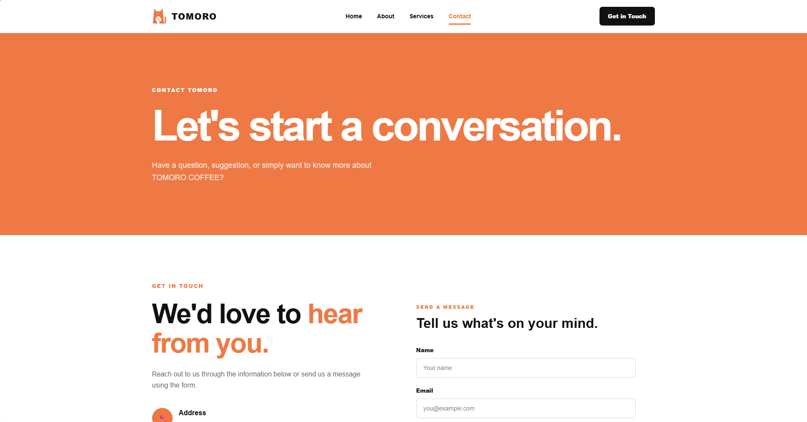

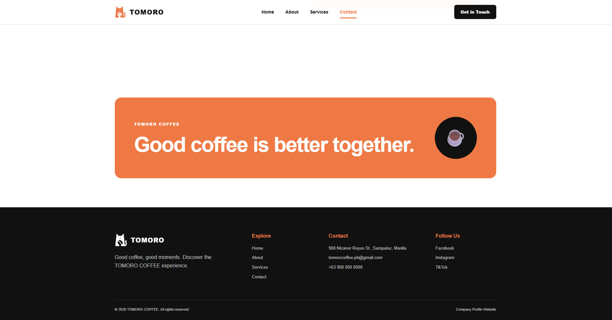

---

### GitHub Repository

<!-- Add github.png inside the screenshots folder, then replace this comment with:
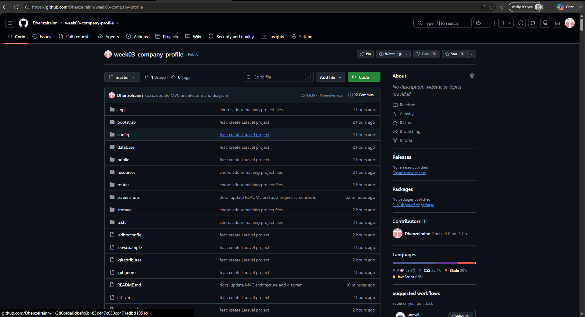
-->

---

## Installation

### 1. Clone the Repository

```bash
git clone <repository-url>
```

### 2. Navigate to the Project

```bash
cd week03-company-profile
```

### 3. Install PHP Dependencies

```bash
composer install
```

### 4. Install Node Dependencies

```bash
npm install
```

### 5. Configure Environment

Create the `.env` file from the example:

```bash
copy .env.example .env
```

Generate the Laravel application key:

```bash
php artisan key:generate
```

### 6. Run the Development Server

Start Laravel:

```bash
php artisan serve
```

The application will be available at:

```text
http://127.0.0.1:8000
```

### 7. Run Vite

In another terminal:

```bash
npm run dev
```

Keep both Laravel and Vite running while viewing the website.

---

## Development Workflow

The project was developed incrementally using Git.

Major development milestones include:

```text
1. Laravel project initialization
2. Company profile controller and routes
3. Reusable layout and navigation components
4. Home page
5. CSS and JavaScript assets
6. Website images
7. About page
8. Services and Contact pages
9. Final visual and responsive design refinement
10. Project documentation
```

Git was used throughout development to track changes and maintain separate commits for major features and improvements.

---

## Git Commit History

The project contains meaningful commits for the different stages of development.

```text
feat: create Laravel project
feat: add company profile controller and routes
feat: add reusable layout and navigation components
feat: add company profile home page
style: add company profile CSS
feat: add company profile JavaScript
feat: add website images
feat: add about page
feat: add services and contact pages
style: refine company profile design
docs: update project README
```

The commit history shows how the project was built step by step instead of being uploaded in a single commit.

---

## Project Purpose

This project was created as part of **ITST 302** to demonstrate the development of a Laravel-based company profile website.

It demonstrates the use of:

- Laravel project structure
- MVC architecture
- Routing
- Controllers
- Blade templates
- Reusable components
- Layout inheritance
- CSS styling
- Responsive web design
- Vite and NPM
- Git version control
- GitHub

---

## Author

**Dhenzel Rain P. Cruz**

BSIT — 3A  
ITST 302

---

## License

This project was created for academic purposes.